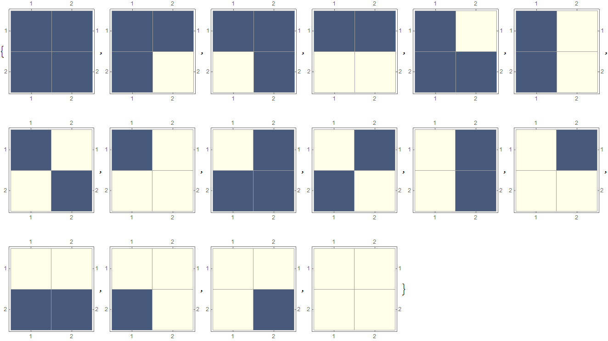
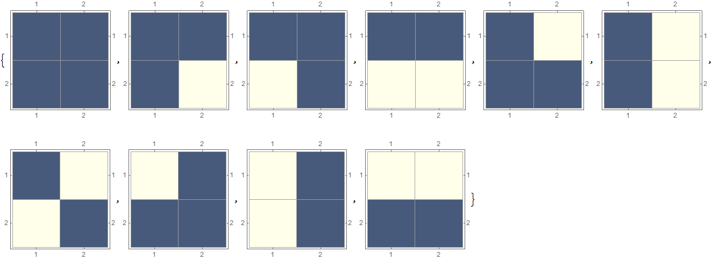
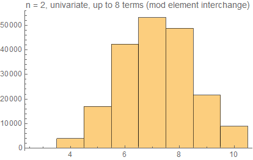
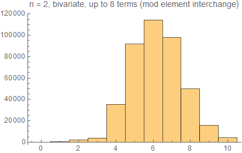

# Automated Discovery of Algebraic Structures

## Generating Operator Tables

We first generate all possible n-by-n tables where each entry is an integer value from 1 to n. This represents all possible operators for the set of size n.

```
FullOpTableList[n_] := 
 Table[Partition[IntegerDigits[i, n, n^2] + 1, n], {i, 0, n^(n^2) - 1}]
```



However, even though there are n^(n^2) operator tables, some of the tables are equivalent up to element interchange. For n = 2, this is transposition; for n = 3, this may also be permutation.

```
TransposeOpTable[s_, 
  t_] := (temp = ReplaceAll[s, {t[[1]] -> t[[2]], t[[2]] -> t[[1]]}];
  temp[[t]] = temp[[{t[[2]], t[[1]]}]];
  temp[[All, t]] = temp[[All, {t[[2]], t[[1]]}]];
  temp)

PermuteOpTable[s_, 
  t_] := (temp = 
   ReplaceAll[
    temp, {t[[1]] -> t[[2]], t[[2]] -> t[[3]], t[[3]] -> t[[1]]}];
  temp[[{t[[2]], t[[3]], t[[1]]}]] = temp[[{t[[1]], t[[2]], t[[3]]}]];
  temp[[All, {t[[2]], t[[3]], t[[1]]}]] = 
   temp[[All, {t[[1]], t[[2]], t[[3]]}]];
  temp)

Partition2OpTableList[s_] := (s1 = s; s2 = {};
  While[Length[s1] > 0, 
   temp = Union[{s1[[1]]}, {TransposeOpTable[s1[[1]], {1, 2}]}];
   AppendTo[s2, temp];
   s1 = DeleteCases[s1, Alternatives @@ temp]];
  s2)

Partition3OpTableList[s_] := (s1 = s; s2 = {};
  While[Length[s1] > 0, 
   temp = Union[{s1[[1]]}, {TransposeOpTable[
       s1[[1]], {1, 2}]}, {TransposeOpTable[
       s1[[1]], {1, 3}]}, {TransposeOpTable[
       s1[[1]], {2, 3}]}, {PermuteOpTable[
       s1[[1]], {1, 2, 3}]}, {PermuteOpTable[s1[[1]], {1, 3, 2}]}];
   AppendTo[s2, temp];
   s1 = DeleteCases[s1, Alternatives @@ temp]];
  s2)
```

This will partition the set of all operator tables into equivalence classes, from which we can then take one representative each. This gives us the option to ignore equivalent operator tables if desired.



## Generating Axioms

We can generate axioms by using the Groupings function as follows.

```
PreAxiomList[s_, n_] := 
 Subsets[Union[s, 
   Groupings[Subsets[Flatten[Table[#, {i, n}] & /@ s]], f -> 2]], {2}]
```

Here, s_ is the set of variables defined for the axiom, and n_ is how many times each element is repeated. This will generate a set of pairs of groupings, and each grouping f[x, y] represents the product of x and y. We can then convert this set format into a usable condition.

```
PreAxiomToAxiom[s_, t_] := 
 ReplaceRepeated[
  ReplaceAll[
   s, {x_, y_} -> Inactivate[x == y]], {f[x_, y_] -> 
    Inactivate[Part[Part[t, x], y]], a -> Inactivate[i], 
   b -> Inactivate[j]}]
```

This treats abstract multiplication as locating an element on the two-dimensional list corresponding to our operator table.

## Enumerating Algebraic Structures

To test a single axiom, we simply see if all the conditions of the axiom are met by the table.

```
TestAxiom[s_, n_] := 
 Boole[And @@ Flatten[Table[Activate[s], {i, n}, {j, n}]]]
```

Counting all axiom systems that work against a given list of operator tables can parallelized.

```
NCountStructuresSinglePreAxiom[s_, t_, n_] := 
 Total[TestAxiom[PreAxiomToAxiom[s, #], n] & /@ t]

NCountStructures[s_, t_, n_] := 
 Parallelize[NCountStructuresSinglePreAxiom[#, t, n] & /@ s]
```

We can see that there is a definite threshold after which the axiom count blows up.


